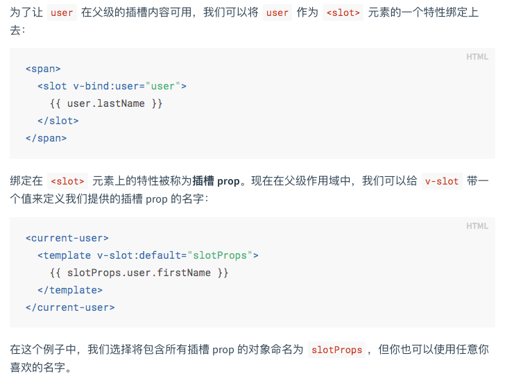
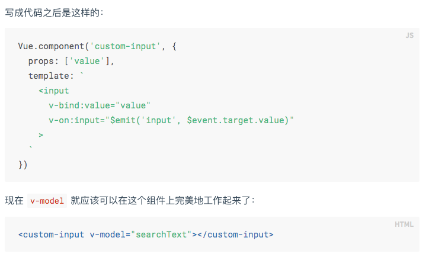

# 本实例涉及到的知识点
1. ES6对象、数组的扩展
    - 对象的扩展运算符 ...good,
    - 数组的扩展方法: find/filter/forEach
2. ES6模块化: import Vue from 'vue'
3. ES6异步方案Promise: axios.get("/api/goods").then(res => {})\
4. ES7异步方案: async + await
5. Vue基础知识
    - 全局安装Vue: npm install -g @vue/cli
    - 开发单个Vue文件: npm install -g @vue/cli-service-global
    - 利用脚手架快速构建Vue工程: vue create vue-demo
    - 动态值、动态属性、动态样式、条件（控制显隐）、列表渲染、事件（@click）、计算属性（computed）、监听属性（watch）、表单双向数据绑定（v-model）
    - 生命周期: init -> created[操作data] -> mounted[操作DOM] -> updated -> destrory
6. Vue组件化机制
    - 6.1 组件的分类
        - 通用组件：比如一些UI库（ElementUI），随时用
        - 业务组件：有特定功能需求的组件，经常复用
        - 页面组件：每个页面就是一个页面组件，一般不会复用
    - 6.2 组件开发
        - 6.2.1 组件注册与使用
            - 全局注册: Vue.component('global-component', {})（可在任意地方直接使用）  
            - 局部注册: 单个Vue文件(使用时需引入)
        - 6.2.2 组件通讯
            - 6.2.2.1 父子组件
                - 单向数据流
                    - 传属性[props]: 父传子
                        - 注意：对于绝大多数特性来说，从外部提供给组件的值会替换掉组件内部设置好的值。但class 和 style 特性会稍微智能一些，即两边的值会被合并起来
                    - 事件[arg参数可以让子组件把值传给父组件]
                        - 子组件触发: $emit('event-name', arg)
                        - 父组件监听：$on('event-name', arg)
                    - 插槽[slot]：父把内容插入子组件中
                        - 编译作用域：父级模板里的所有内容都是在父级作用域中编译的；子模板里的所有内容都是在子作用域中编译的。  
                        
                        - 具名插槽：slot只能添加在```<template slot="">```上
                        - 作用域插槽: 插槽内容访问子组件中才有的数据  
                        
                - 双向数据流
                    - 父子组件双向数据绑定的实现: 自定义组件的v-model
                        - 子组件：```<custom-input :value="searchText" @input="searchText = $event"></custom-input>```
                            - 将其value特性绑定到一个名叫value的prop上
                            - 在其input事件被触发时，将新的值通过自定义的input事件抛出
                        - 父组件：```<custom-input model="searchText"></custom-input>```  
                        
                    - props + 事件
                    - .sync 修饰符  
                    

            - 6.2.2.2 任意组件通讯机制:
                - 总线模式 Vue.prototype.$bus = new Vue();
                - 事件监听 $on && 事件派发 $emit
7. 使用axios请求数据: npm install axios
8. mock数据
9. ElementUI的使用
    - 安装
        - npm方式安装：npm i element-ui -S
        - 通过vue-cli安装：vue add element
    - 注意
        - 在安装时如果选择了按需加载，那么在引用ui组件时，需要在plugins/elements.js中手动引入对应组件
    
                   
                 
                                                  
                   
                 
                                         