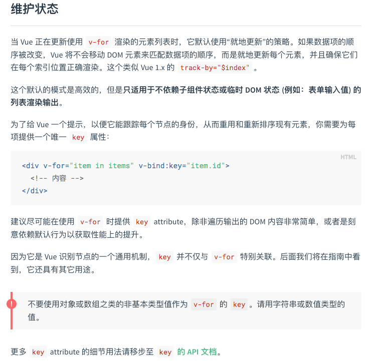
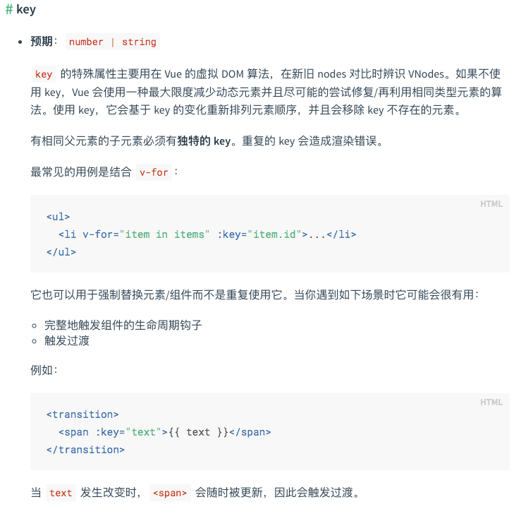

1. 使用vue-for渲染列表时，为什么需要加:key?  

  

2. computed与watch的区别?  
computed: 计算A属性在data对象里的a属性发生变化时，A的值【关注两个属性】  
watch: 监听data对象里的a属性发生变化时，要做的事【关注一个属性】

3. 插槽的作用域编译  
官方：父级模板里的所有内容都是在父级作用域中编译的；子模板里的所有内容都是在子作用域中编译的  
我的理解：在父级模板里，当用“具体的内容”替换掉子模板的插槽时，看起来好像是“具体的内容”填充到了子模板的slot位置，但其实这个“具体的内容”还是属于父级模板的东西，它无法访问子模板的作用域。  

4. vue-router的hash模式和history为什么都能不刷新地更新页面视图？  
    - hash模式：Hash(即#)是url的锚点,代表的是网页中的一个位置,仅仅改变#后面部分,浏览器只会滚动对应的位置,而不会重新加载页面。  
    ```javascript
        window.addEventListener("hashchange", function () {
            switch (location.hash) {
                case '#/login':
                    div.innerHTML = '<h1>登录页面</h1>';
                    break;
                case '#/register':
                    div.innerHTML = '<h1>注册页面</h1>';
                    break;
            }
        })
    ```
    - history模式：history提供的pushState和replaceState2个API提供了操作浏览器历史栈的方法，且不会主动触发浏览器reload。
        - pushState方法在改变url的同时向浏览器历史栈中压入新的历史记录
        - replaceState替换当前的浏览器历史记录
        - 通过pushState或者replaceState来改变URL且不发生浏览器刷新的话，再使用history.back()或history.go(),这样popstate事件才会被触发。
        - 注意：在某个web应用当中，比如点击了`<a>`标签，发生了页面的跳转。这时调用history.back();方法后页面回退，同时页面发生刷新,这时window.onpopstate无法监听这个事件。
        ```javascript
            history.pushState({page: 1}, null, '?page=1');
            history.pushState({page: 2}, null, '?page=2');
            history.back(); //浏览器后退
            window.addEventListener('popstate', function(e) {
                //在popstate事件触发后,事件对象event保存了当前浏览器历史记录的状态.
                //e.state保存了pushState添加的state的引用
                console.log(e.state);  //输出 {page: 1}
            });
        ```
    - history模式的地址有利于搜索引擎识别,但需要服务器支持。
    
5. Vuex和单纯的全局对象的不同点？
    - Vuex的状态存储是响应式的。当 Vue 组件从 store 中读取状态的时候，若 store 中的状态发生变化，那么相应的组件也会相应地得到高效更新。
    - 不能直接改变 store 中的状态。改变 store 中的状态的唯一途径就是显式地提交 (commit) mutation。
