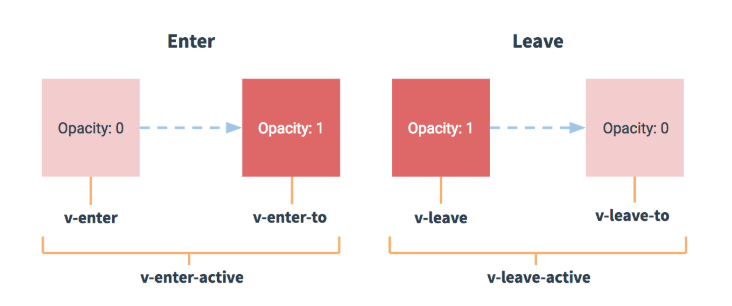
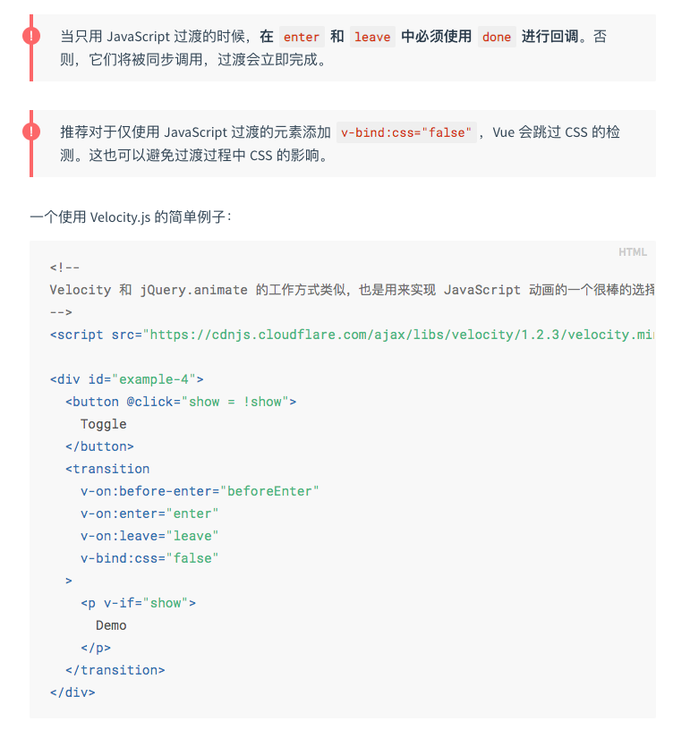
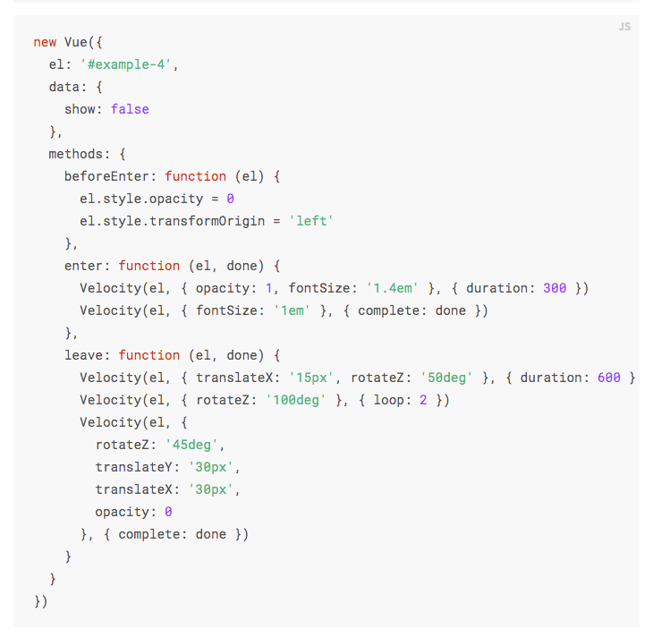

# 一、Vue
1. ES6对象、数组的扩展
    - 对象的扩展运算符 ...good,
    - 数组的扩展方法: find/filter/forEach/map/reduce
        - find: 查找第一个符合条件的数组元素
        - filter: 查找所有符合条件的数组元素
        - map: 映射数组每一项，返回新数组
        - forEach: 遍历数组每一项，对每一项进行操作
2. ES6模块化: import Vue from 'vue'
3. ES6异步方案Promise: axios.get("/api/goods").then(res => {})
4. ES7异步方案: async + await
5. Vue基础知识
    - 全局安装Vue脚手架: npm install -g @vue/cli
    - 开发单个Vue文件: npm install -g @vue/cli-service-global
    - 利用脚手架快速构建Vue工程: vue create vue-demo
    - 动态值、动态属性、动态样式`:class="{'active': item.active}"`、条件（控制显隐）、列表渲染、事件（@click）、计算属性（computed）、监听属性（watch）、表单双向数据绑定（v-model）
    - 生命周期: init -> created[操作data] -> mounted[操作DOM] -> updated -> destrory
6. Vue组件化机制
    - 6.1 组件注册与使用
        - 全局注册: Vue.component('global-component', {})（可在任意地方直接使用）  
        - 局部注册: 单个Vue文件(使用时需引入)
    - 6.2 组件通讯
        - 6.2.1 父子组件
            - 单向数据流
                - 传属性[props]: 父传子  
                注意：对于绝大多数特性来说，从外部提供给组件的值会替换掉组件内部设置好的值。但class 和 style 特性会稍微智能一些，即两边的值会被合并起来
                - 事件[arg参数可以让子组件把值传给父组件]  
                    - 子组件触发: $emit('event-name', arg)  
                    - 父组件监听：$on('event-name', arg)  
                - 插槽[slot]：父把内容插入子组件中  
                    - 作用：如果`<navigation-link>` 没有包含一个 `<slot> `元素，则该组件起始标签和结束标签之间的任何内容都会被抛弃
                    - 编译作用域：父级模板里的所有内容都是在父级作用域中编译的；子模板里的所有内容都是在子作用域中编译的。
                    - 作用域插槽: 插槽内容访问子组件中才有的数据
                    - 具名插槽：v-slot只能添加在```<template v-slot:header>```上(独占默认插槽这种情况除外),这一点和已经废弃的slot特性不同。  
            - 双向数据流
                - 父子组件双向数据绑定的实现: 自定义组件的v-model
                    - 子组件：```<custom-input :value="searchText" @input="searchText = $event"></custom-input>```
                    - 父组件：```<custom-input model="searchText"></custom-input>```  
                    
                - props + 事件
                - .sync 修饰符  
                
        - 6.2.2 任意组件通讯:
            - 总线模式
                - Vue.prototype.$bus = new Vue(); 
                - this.$bus.$emit("eventName", arg);
                - this.$bus.$on("eventName", arg);
            - 依赖注入: provide && inject
            - Vuex
    - 6.2.3 动态组件: 当在这些组件之间切换的时候，你有时会想保持这些组件的状态，以避免反复重渲染导致的性能问题  
      
    - 6.2.4 异步组件: 在大型应用中，我们可能需要将应用分割成小一些的代码块，并且只在需要的时候才从服务器加载一个模块。
    - 6.3 处理边界情况
        - 6.3.1 访问元素 & 组件
            - 访问根实例：this.$root  
            - 访问父级实例：this.$parent
            - 访问子组件实例或子元素: this.$ref
            - 依赖注入: provide && inject  
            
        - 6.3.2 程序化的事件侦听器
            - $on(eventName, eventHandler) 侦听一个事件
            - $once(eventName, eventHandler) 一次性侦听一个事件
            - $off(eventName, eventHandler) 停止侦听一个事件
        - 6.3.3 控制更新
            - 强制更新[作用类似于刷新页面]：vm.$forceUpdate
            - 静态组件：v-once
7. 使用axios请求数据: npm install axios
8. mock数据
9. ElementUI的使用
    - 安装
        - npm方式安装：npm i element-ui -S
        - 通过vue-cli安装：vue add element
    - 注意
        - 在安装时如果选择了按需加载，那么在引用ui组件时，需要在plugins/elements.js中手动引入对应组件
10. 过渡 & 动画
    - 概述：Vue 在插入、更新或者移除 DOM 时，提供多种不同方式的应用过渡效果
        - 在 CSS 过渡和动画中自动应用 class
        - 在过渡钩子函数中使用 JavaScript 直接操作 DOM
        - 配合使用第三方 CSS 动画库，如 Animate.css
        - 可以配合使用第三方 JavaScript 动画库，如 Velocity.js
    - 进入/离开过渡
        - 特点：单个节点、同一时间渲染多个节点中的一个
        - 触发条件：Vue 提供了 transition 的封装组件，在下列情形中，可以给任何元素和组件添加进入/离开过渡
            - 条件渲染：v-if & v-show
            - 组件根节点
            - 动态组件
        - 进入/离开过渡的类型
            - 单元素/组件的过渡
                - 过渡类名  
                
                - 过渡效果
                    - css过渡
                        - `v-enter-active,v-leave-active {transition: ;}`
                    - css动画：CSS 动画用法同 CSS 过渡，区别是在动画中 v-enter 类名在节点插入 DOM 后不会立即删除，而是在 animationend 事件触发时删除
                        - `v-enter-active,v-leave-active {animation: ;}`
                    - 自定义过渡的类名：他们的优先级高于普通的类名，这对于 Vue 的过渡系统和其他第三方 CSS 动画库，如 Animate.css 结合使用十分有用
                    - 同时设置过渡和动画
                        - Vue 为了知道过渡的完成，必须设置相应的事件监听器。它可以是 transitionend 或 animationend ，这取决于给元素应用的 CSS 规则。如果你使用其中任何一种，Vue 能自动识别类型并设置监听。
                        - 但是，在一些场景中，你需要给同一个元素同时设置两种过渡动效，比如 animation 很快的被触发并完成了，而 transition 效果还没结束。在这种情况中，你就需要使用 type 特性并设置 animation 或 transition 来明确声明你需要 Vue 监听的类型。
                    - 显性的过渡持续时间
                        - `<transition :duration="1000">...</transition>`
                    - JavaScript 钩子  
                      
                    
            - 初始渲染的过渡
                - 可以通过 appear 特性设置节点在初始渲染的过渡
                - `<transition appear>...</transition>`
            - 多个元素的过渡
                - 对于原生标签可以使用 v-if/v-else  
                    ```html
                    <transition>
                        <table v-if="items.length > 0">
                            <!-- ... -->
                        </table>
                        <p v-else>Sorry, no items found.</p>
                    </transition>
                    ```
                - 当有相同标签名的元素切换时，需要通过 key 特性设置唯一的值来标记以让 Vue 区分它们，否则 Vue 为了效率只会替换相同标签内部的内容。
                    ```html
                    <transition>
                        <button v-if="isEditing" key="save">
                            Save
                        </button>
                        <button v-else key="edit">
                            Edit
                        </button>
                    </transition>
                    ```
                - 过渡模式
                    - 多个元素的过渡默认行为：新元素的进入和旧元素离开同时发生
                    - 同时生效的进入和离开的过渡不能满足所有要求，所以 Vue 提供了 过渡模式
                        - in-out：新元素先进行过渡，完成之后当前元素过渡离开
                        - out-in：当前元素先进行过渡，完成之后新元素过渡进入  
                        ```html
                        <transition name="fade" mode="out-in">
                            <!-- ... the buttons ... -->
                        </transition>
                        ```
            - 多个组件的过渡
                - 不需要使用 key 特性，只需要使用动态组件
                    ```html
                    <transition name="component-fade" mode="out-in">
                        <component v-bind:is="view"></component>
                    </transition>
                    ```
            - 列表过渡
            - 可复用的过渡
            - 动态过渡        
    - 列表过渡
        - 特点：同时渲染整个列表，在这种场景中，使用`<transition-group>`组件
            - 不同于`<transition>`，它会以一个真实元素呈现：默认为一个`<span>`。可以通过 tag 特性更换为其他元素
            - 过渡模式不可用，因为我们不再相互切换特有的元素
            - 内部元素 总是需要 提供唯一的 key 属性值
            - CSS 过渡的类将会应用在内部的元素中，而不是这个组/容器本身
        - 列表过渡的类型
            - 列表的进入/离开过渡
            ```html
                <transition-group name="list" tag="p">
                    <span v-for="item in items" v-bind:key="item" class="list-item">
                    {{ item }}
                    </span>
                </transition-group>
            ```
            ```css
                .list-enter-active, .list-leave-active { transition: all 1s;}
                .list-enter, .list-leave-to { opacity: 0; transform: translateY(30px);}
            ```
            - 列表的排序过渡
                - `<transition-group>`组件还有一个特殊之处。不仅可以进入和离开动画，还可以改变定位。要使用这个新功能只需了解新增的 v-move 特性，它会在元素的改变定位的过程中应用。像之前的类名一样，可以通过 name 属性来自定义前缀，也可以通过 move-class 属性手动设置
                ```html
                    <transition-group name="list" tag="p">
                        <span v-for="item in items" v-bind:key="item" class="list-item">
                        {{ item }}
                        </span>
                    </transition-group>
                ```
                ```css
                    .list-enter-active, .list-leave-active { transition: all 1s;}
                    .list-leave-active { position: absolute;}
                    .list-enter, .list-leave-to { opacity: 0; transform: translateY(30px);}
                    .list-move {transition: all 1s;} /*加了这个之后，比上面例子的过渡平滑*/
                ```
    - 可复用的过渡
        - 过渡可以通过 Vue 的组件系统实现复用。要创建一个可复用过渡组件，你需要做的就是将`<transition>` 或者 `<transition-group>` 作为根组件，然后将任何子组件放置在其中就可以了
    - 动态过渡
        - 在 Vue 中即使是过渡也是数据驱动的,所有过渡特性都可以动态绑定
    - 状态过渡
        - 概述：对于数据元素本身的动效，比如
            - 数字和运算
            - 颜色的显示
            - SVG 节点的位置
            - 元素的大小和其他的属性
# 二、vue-router
1. vue-router基础语法
    - 1.1  router vs route vs routes
        - router: 路由器。this.$router访问路由器 
        - route: 路由。this.$route访问当前路由
        - routes: 指router路由实例的routes API.用来配置多个route路由对象
    - 1.2 动态路由匹配
        - 路径参数：/user/:username/post/:post_id + /user/evan/post/123 => $route.params {username: 'evan', post_id: 123}     
        - 查询参数：/foo?id=1 => $route.query {id: 1}
        - 路径参数 vs 查询参数
            - 路径参数：语义化的路径组成部分，必传参
            - 查询参数：和业务逻辑无关的路径组成部分，可传参
    - 1.3 路由组件传参[props]
        - 布尔模式：{props: true},传route.params的值
        - 对象模式：props: {staticProp: 'staticVal'},传静态值
        - 函数模式: props: route => ({...}),传路由参数和静态值
    - 1.4 路由跳转的方式
        - 声明式: `<router-link :to=''>`,`<router-link :to="..." replace>`
        - 编程式: `this.$router.push({})`,`this.$router.replace({})`,`this.$router.go(n)`
    - 1.4 嵌套路由：children
        - children 配置就是像 routes 配置一样的路由配置数组
    - 1.5 重定向和别名
        - 重定向：redirect
            - {path: '/', redirect: '/home'}
            - 访问'/',跳转到'/home',展示Home视图的内容
        - 别名：alias
            - {path: '/home', component: Home, alias: '/index'}
            - 访问'/index',跳转到'/index'，展示Home视图的内容
2. vue-router进阶语法
    - 2.1、导航守卫
        - 全局导航守卫
            - 全局前置守卫: beforeEach((to, from, next) => {})
            - 全局后置钩子: afterEach((to, from) => {})
        - 单个路由独享的守卫: beforeEnter((to, from, next) => {})
        - 组件级守卫
        ```javascript
            beforeRouteEnter (to, from, next) {
                // 在渲染该组件的对应路由被 confirm 前调用
                // 不！能！获取组件实例 `this`
                // 因为当守卫执行前，组件实例还没被创建
            },
            // 不过，你可以通过传一个回调给 next来访问组件实例。在导航被确认的时候执行回调，并且把组件实例作为回调方法的参数
            // 注意 beforeRouteEnter 是支持给 next 传递回调的唯一守卫。对于 beforeRouteUpdate 和 beforeRouteLeave 来说，this 已经可用了，所以不支持传递回调，因为没有必要了。
            beforeRouteEnter (to, from, next) {
                next(vm => {
                // 通过 `vm` 访问组件实例
                })
            }
            beforeRouteUpdate (to, from, next) {
                // 在当前路由改变，但是该组件被复用时调用
                // 举例来说，对于一个带有动态参数的路径 /foo/:id，在 /foo/1 和 /foo/2 之间跳转的时候，
                // 由于会渲染同样的 Foo 组件，因此组件实例会被复用。而这个钩子就会在这个情况下被调用。
                // 可以访问组件实例 `this`
            },
            // 这个离开守卫通常用来禁止用户在还未保存修改前突然离开
            beforeRouteLeave (to, from, next) {
                // 导航离开该组件的对应路由时调用
                // 可以访问组件实例 `this`
            }
        ```
    - 2.2 完整的导航解析流程
        - 导航被触发。
        - 在失活的组件里调用离开守卫。
        - 调用全局的 beforeEach 守卫。
        - 在重用的组件里调用 beforeRouteUpdate 守卫 (2.2+)。
        - 在路由配置里调用 beforeEnter。
        - 解析异步路由组件。
        - 在被激活的组件里调用 beforeRouteEnter。
        - 调用全局的 beforeResolve 守卫 (2.5+)。
        - 导航被确认。
        - 调用全局的 afterEach 钩子。
        - 触发 DOM 更新。
        - 用创建好的实例调用 beforeRouteEnter 守卫中传给 next 的回调函数。
    - 2.3 路由元信息：meta: {requiresAuth: true}
        - 作用：在路由导航时，有配置meta字段的，表示需要认证，即需要先登录才能跳到该页面
    - 2.4 过渡动效：`<transition><router-view></router-view></transition>`
    - 2.5 数据获取  
    进入某个路由后，需要从服务器获取数据。可以通过两种方式来实现：
        - 导航完成后获取数据：在组件的 created 钩子中获取数据
        - 在导航完成前获取数据: 在导航转入新的路由前获取数据。我们可以在接下来的组件的 beforeRouteEnter 守卫中获取数据，当数据获取成功后只调用 next 方法。
        ```javascript
        beforeRouteEnter (to, from, next) {
            getPost(to.params.id, (err, post) => {
                next(vm => vm.setData(err, post))
            })
        }
        ```
    - 2.6 滚动行为：自定义路由切换时页面如何滚动
    ```javascript
    const router = new VueRouter({
        routes: [...],
        scrollBehavior (to, from, savedPosition) {
        // return 期望滚动到哪个的位置
        }
    })
    ```
    - 2.7 路由懒加载：当路由被访问的时候才加载对应组件
        - 原理：结合 Vue 的异步组件和 Webpack 的代码分割功能
        - 使用方法：const Foo = () => import('./Foo.vue')
# 三、vuex
- 安装：vue add vuex
- 核心概念
    - 仓库[store]：一个容器，包含着应用中大部分的状态 (state)
    - 状态[state]
        - 单一状态树，一个对象就包含了全部的应用层级状态，即它作为一个“唯一数据源”而存在，这意味着，每个应用将仅仅包含一个 store 实例。单状态树和模块化并不冲突。
        - 使用 Vuex 并不意味着所有的状态放入 Vuex，如果有些状态严格属于单个组件，最好还是作为组件的局部状态。
    - 计算属性[getter]
    - 更改store中的状态[mutations]&&[actions]
        - mutations:（1）直接变更状态（2）必须是同步事务
        ```javascript
        // store.js
        mutations() {
            addCount(state, n) {
                state.count += n;
            },
        },
        // views
        this.$store.commit('addCount', 1)
        ```
        - actions:（1）提交的是 mutation，而不是直接变更状态（2）可以包含任意异步操作
        ```javascript
        // store.js
        actions () {
            addNumAsync({commit},n) {
                setTimeout(()=>{
                    commit('addNum',n);
                },1000)
            }
        }
        // views
        this.$store.dispatch('addNumAsync',1);
        ```
    - 模块[modules]
        - 基本用法
        ```javascript
            const moduleA = {stete: {}, getters: {}, mutations: {}, actions: {}}
            const moduleB = {stete: {}, getters: {}, mutations: {}, actions: {}}
            const store = new Vuex.store({
                modules: {a: moduleA, b: modouleB}
            })
        ```
        - 模块的局部状态
            - 模块的局部状态对象:
                - mutations && getters[第一个参数]: state
                - actions: context.state
            - 根节点状态
                - getters[第三个参数]: rootState
                - actions: context.rootState
# 四、使用vue全家桶构建电商项目
- 开发思路
    - 第一天
        - 安装: @vue/cli 3.x(vuex,vur-router), Cube-UI, axios
        - router.js
            - 为页面配置路由，并标记[token]哪些页面需要登录
            - 全局路由拦截，认证token
        - store.js
            - 设置token, 并提供修改token的方法
            - 根据token的值判断用户的登录状态：isLogin
        - main.js 
            - 为Vue原型增加$http方法
            - 引入http-interceptor.js
        - http-interceptor.js[前端]
            - 请求拦截器：在每个请求都把token放入请求头，供服务器校验[用户鉴权]
            - 响应拦截器：如果请求返回-1,说明用户处于注销状态或者token已经过期（401），则需要把浏览器保存的token[state和localStorage]清空，并且跳转到登录页面进行登录，然后再重定向回目的页面 
        - vue.config.js[后端]
            - 搭建一个简易服务器：CLI服务是基于 webpack的webpack-dev-server
                - 中间件：验证浏览器传过来的token，如果token不存在则返回401，提示用户去登录
                - 提供登录、注销接口
        - 登录功能
            - 把token存入vuex.state.token和localStorage,登录成功后,页面重定向至目标页面
        - 注销功能
            - 把token[state和localStorage]清空
        - 拓展
            - 处理post请求
            - 设置token有效期
            - 表单异步校验
    - 第二天
        - 设计页面
            - 首页：轮播图`cube-slide`，商品列表`cube-scroll-nav`，商品过滤列表`cube-drawer`[添加商品到购物车]，底部导航栏`cube-tab-bar`，添加到购物车的商品数量[重构`cube-tab-bar`组件]
            - 购物车：购物车的商品列表：增加商品，减少商品，结算
            - ”添加商品到购物车“、”‘增加商品“、”减少商品“这三个动作的执行所导致的状态变化要由`store.subscribe((mutation, state) => {})`来监听
            - 我的：登录、注销
    - 第三天
        - 优化
            - 构建全局`<header>`组件
            - `<header>`组件的返回按钮功能
                - History插件模拟历史记录堆栈
                - 全局路由守卫afterEach: 记录路由的入栈和出栈
                - 根据入栈[前进]还是出栈[后退]动态添加不同的动画过渡效果
            - ”添加商品到购物车“动画效果”[js动画]
            - 购物车页面“上拉刷新”和“下拉加载更多”功能
            - 全局组件的设计和使用：游离于`<div id="app"></div>`之外，类似于cube-ui的this.$createToast。实现以 API 的形式调用自定义组件，并且既可以在 Vue 实例上下文中调用，也可以在普通 js 文件中调用
                - 方法一：利用cube-ui的create-api模块
                - 方法二：使用原生方法自己实现
# 五、vue全家桶底层原理
- 数据监听
    - Observer: 监听data属性
    - Dependency && Watcher: 依赖收集与追踪
- 编译模板
- 将实例挂载到 DOM 并在数据变化时更新 DOM 
- 


               
                 
                                                  
                   
                 
                                         