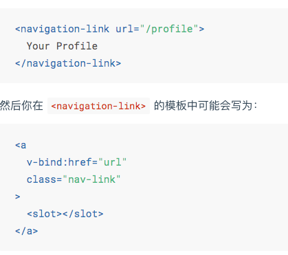
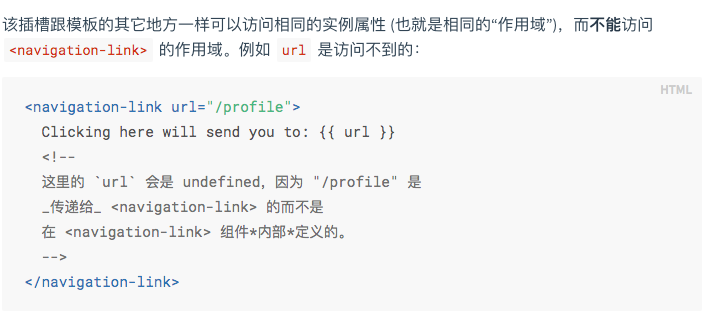
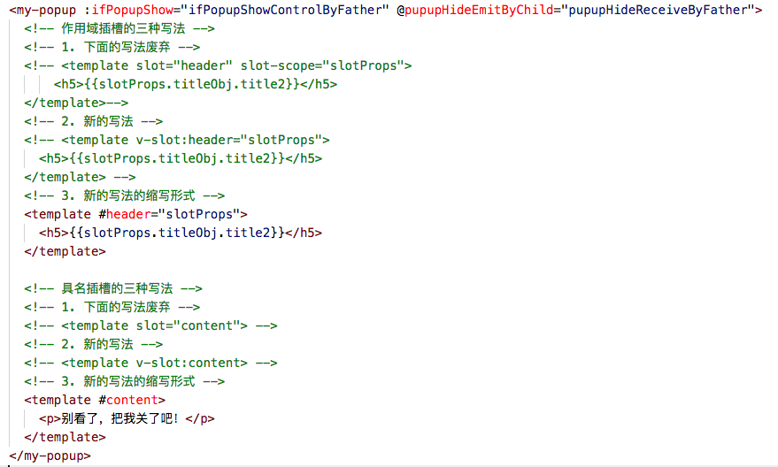
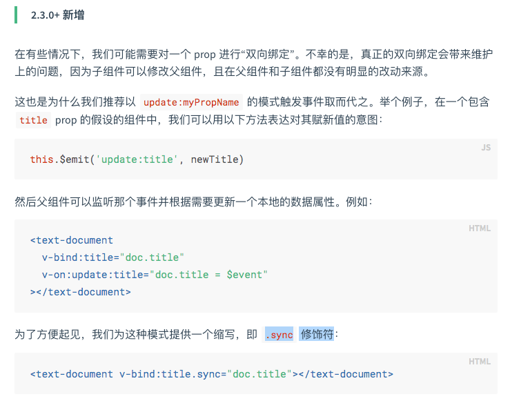
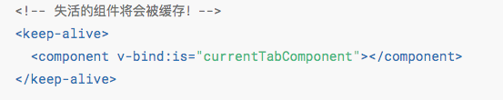
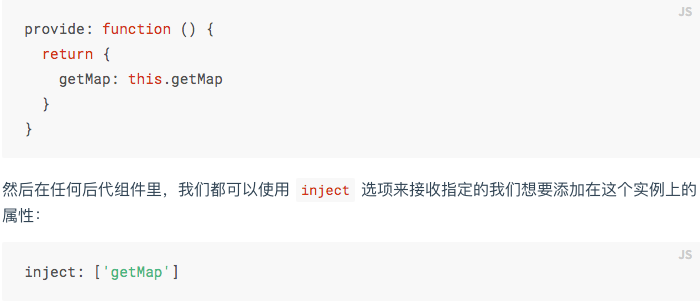

# 一、Vue
1. ES6对象、数组的扩展
    - 对象的扩展运算符 ...good,
    - 数组的扩展方法: find/filter/forEach/map
2. ES6模块化: import Vue from 'vue'
3. ES6异步方案Promise: axios.get("/api/goods").then(res => {})\
4. ES7异步方案: async + await
5. Vue基础知识
    - 全局安装Vue: npm install -g @vue/cli
    - 开发单个Vue文件: npm install -g @vue/cli-service-global
    - 利用脚手架快速构建Vue工程: vue create vue-demo
    - 动态值、动态属性、动态样式、条件（控制显隐）、列表渲染、事件（@click）、计算属性（computed）、监听属性（watch）、表单双向数据绑定（v-model）
    - 生命周期: init -> created[操作data] -> mounted[操作DOM] -> updated -> destrory
6. Vue组件化机制
    - 6.1 组件的分类
        - 通用组件：比如一些UI库（ElementUI），随时用
        - 业务组件：有特定功能需求的组件，经常复用
        - 页面组件：每个页面就是一个页面组件，一般不会复用
    - 6.2 组件开发
        - 6.2.1 组件注册与使用
            - 全局注册: Vue.component('global-component', {})（可在任意地方直接使用）  
            - 局部注册: 单个Vue文件(使用时需引入)
        - 6.2.2 组件通讯
            - 6.2.2.1 父子组件
                - 单向数据流
                    - 传属性[props]: 父传子  
                    注意：对于绝大多数特性来说，从外部提供给组件的值会替换掉组件内部设置好的值。但class 和 style 特性会稍微智能一些，即两边的值会被合并起来
                    - 事件[arg参数可以让子组件把值传给父组件]  
                    子组件触发: $emit('event-name', arg)  
                    父组件监听：$on('event-name', arg)  
                    - 插槽[slot]：父把内容插入子组件中  
                        - 作用：如果`<navigation-link>` 没有包含一个 `<slot> `元素，则该组件起始标签和结束标签之间的任何内容都会被抛弃  
                          
                        - 编译作用域：父级模板里的所有内容都是在父级作用域中编译的；子模板里的所有内容都是在子作用域中编译的。  
                          
                        - 具名插槽：v-slot只能添加在`<template v-slot:header>`上[独占默认插槽这种情况除外],这一点和已经废弃的slot特性不同。
                        - 作用域插槽: 插槽内容访问子组件中才有的数据  
                          
                - 双向数据流
                    - 父子组件双向数据绑定的实现: 自定义组件的v-model
                        - 子组件：```<custom-input :value="searchText" @input="searchText = $event"></custom-input>```
                            - 将其value特性绑定到一个名叫value的prop上
                            - 在其input事件被触发时，将新的值通过自定义的input事件抛出
                        - 父组件：```<custom-input model="searchText"></custom-input>```  
                        
                    - props + 事件
                    - .sync 修饰符  
                    
            - 6.2.2.2 任意组件通讯:
                - 总线模式
                    - Vue.prototype.$bus = new Vue(); 
                    - this.$bus.$emit("eventName", arg);
                    - this.$bus.$on("eventName", arg);
                - 依赖注入: provide && inject
                - Vuex
        - 6.2.3 动态组件    
          
        - 6.2.4 异步组件: 在大型应用中，我们可能需要将应用分割成小一些的代码块，并且只在需要的时候才从服务器加载一个模块。
    - 6.3 处理边界情况
        - 6.3.1 访问元素 & 组件
            - 访问根实例：this.$root  
            - 访问父级实例：this.$parent
            - 访问子组件实例或子元素: this.$ref
            - 依赖注入: provide && inject  
            
        - 6.3.2 程序化的事件侦听器
            - $on(eventName, eventHandler) 侦听一个事件
            - $once(eventName, eventHandler) 一次性侦听一个事件
            - $off(eventName, eventHandler) 停止侦听一个事件
        - 6.3.3 控制更新
            - 强制更新：$forceUpdate
            - 静态组件：v-once
7. 使用axios请求数据: npm install axios
8. mock数据
9. ElementUI的使用
    - 安装
        - npm方式安装：npm i element-ui -S
        - 通过vue-cli安装：vue add element
    - 注意
        - 在安装时如果选择了按需加载，那么在引用ui组件时，需要在plugins/elements.js中手动引入对应组件

# 二、vue-router
1. vue-router基础语法
    - 1.1  router vs route vs routes
        - router: 路由器。this.$router访问路由器 
        - route: 路由。this.$route访问当前路由
        - routes: 指router路由实例的routes API.用来配置多个route路由对象
    - 1.2 动态路由匹配
        - 路径参数：/user/:username/post/:post_id + /user/evan/post/123 => $route.params {username: 'evan', post_id: 123}     
        - 查询参数：/foo?id=1 => $route.query {id: 1}
        - 路径参数 vs 查询参数
            - 路径参数：语义化的路径组成部分，必传参
            - 查询参数：和业务逻辑无关的路径组成部分，可传参
    - 1.3 路由组件传参[props]
        - 布尔模式：{props: true},传route.params的值
        - 对象模式：props: {staticProp: 'staticVal'},传静态值
        - 函数模式: props: route => ({...}),传路由参数和静态值
    - 1.4 路由跳转的方式
        - 声明式: `<router-link :to=''>`,`<router-link :to="..." replace>`
        - 编程式: `this.$router.push({})`,`this.$router.replace({})`,`this.$router.go(n)`
    - 1.4 嵌套路由：children
        - children 配置就是像 routes 配置一样的路由配置数组
    - 1.5 重定向和别名
        - 重定向：redirect
            - {path: '/', redirect: '/home'}
            - 访问'/',跳转到'/home',展示Home视图的内容
        - 别名：alias
            - {path: '/home', component: Home, alias: '/index'}
            - 访问'/index',跳转到'/index'，展示Home视图的内容
2. vue-router进阶语法
    - 2.1、导航守卫
        - 全局导航守卫
            - 全局前置守卫: beforeEach((to, from, next) => {})
            - 全局后置钩子: afterEach((to, from) => {})
        - 单个路由独享的守卫: beforeEnter((to, from, next) => {})
        - 组件级守卫
        ```javascript
            beforeRouteEnter (to, from, next) {
                // 在渲染该组件的对应路由被 confirm 前调用
                // 不！能！获取组件实例 `this`
                // 因为当守卫执行前，组件实例还没被创建
            },
            // 不过，你可以通过传一个回调给 next来访问组件实例。在导航被确认的时候执行回调，并且把组件实例作为回调方法的参数
            // 注意 beforeRouteEnter 是支持给 next 传递回调的唯一守卫。对于 beforeRouteUpdate 和 beforeRouteLeave 来说，this 已经可用了，所以不支持传递回调，因为没有必要了。
            beforeRouteEnter (to, from, next) {
                next(vm => {
                // 通过 `vm` 访问组件实例
                })
            }
            beforeRouteUpdate (to, from, next) {
                // 在当前路由改变，但是该组件被复用时调用
                // 举例来说，对于一个带有动态参数的路径 /foo/:id，在 /foo/1 和 /foo/2 之间跳转的时候，
                // 由于会渲染同样的 Foo 组件，因此组件实例会被复用。而这个钩子就会在这个情况下被调用。
                // 可以访问组件实例 `this`
            },
            // 这个离开守卫通常用来禁止用户在还未保存修改前突然离开
            beforeRouteLeave (to, from, next) {
                // 导航离开该组件的对应路由时调用
                // 可以访问组件实例 `this`
            }
        ```
    - 2.2 完整的导航解析流程
        - 导航被触发。
        - 在失活的组件里调用离开守卫。
        - 调用全局的 beforeEach 守卫。
        - 在重用的组件里调用 beforeRouteUpdate 守卫 (2.2+)。
        - 在路由配置里调用 beforeEnter。
        - 解析异步路由组件。
        - 在被激活的组件里调用 beforeRouteEnter。
        - 调用全局的 beforeResolve 守卫 (2.5+)。
        - 导航被确认。
        - 调用全局的 afterEach 钩子。
        - 触发 DOM 更新。
        - 用创建好的实例调用 beforeRouteEnter 守卫中传给 next 的回调函数。
    - 2.3 路由元信息：meta: {requiresAuth: true}
        - 用户：在路由导航时，有配置meta字段的，表示需要认证，即需要先登录才能跳到该页面
    - 2.4 过渡动效：`<transition><router-view></router-view></transition>`
    - 2.5 数据获取  
    进入某个路由后，需要从服务器获取数据。可以通过两种方式来实现：
        - 导航完成后获取数据：在组件的 created 钩子中获取数据
        - 在导航完成前获取数据: 在导航转入新的路由前获取数据。我们可以在接下来的组件的 beforeRouteEnter 守卫中获取数据，当数据获取成功后只调用 next 方法。
        ```javascript
        beforeRouteEnter (to, from, next) {
            getPost(to.params.id, (err, post) => {
                next(vm => vm.setData(err, post))
            })
        }
        ```
    - 2.6 滚动行为：自定义路由切换时页面如何滚动
    ```javascript
    const router = new VueRouter({
        routes: [...],
        scrollBehavior (to, from, savedPosition) {
        // return 期望滚动到哪个的位置
        }
    })
    ```
    - 2.7 路由懒加载：当路由被访问的时候才加载对应组件
        原理：结合 Vue 的异步组件和 Webpack 的代码分割功能
        使用方法：const Foo = () => import('./Foo.vue')

# 三、vuex
- 安装：vue add vuex
- 核心概念
    - 仓库[store]：一个容器，包含着应用中大部分的状态 (state)
    - 状态[state]
        - 单一状态树，一个对象就包含了全部的应用层级状态，即它作为一个“唯一数据源”而存在，这意味着，每个应用将仅仅包含一个 store 实例。单状态树和模块化并不冲突。
        - 使用 Vuex 并不意味着所有的状态放入 Vuex，如果有些状态严格属于单个组件，最好还是作为组件的局部状态。
    - 计算属性[getter]
    - 更改store中的状态[mutations]&&[actions]
        - mutations:（1）直接变更状态（2）必须是同步事务
        ```javascript
        // store.js
        mutations() {
            addCount(state, n) {
                state.count += n;
            },
        },
        // views
        this.$store.commit('addCount', 1)
        ```
        - actions:（1）提交的是 mutation，而不是直接变更状态（2）可以包含任意异步操作
        ```javascript
        // store.js
        actions () {
            addNumAsync({commit},n) {
                setTimeout(()=>{
                    commit('addNum',n);
                },1000)
            }
        }
        // views
        this.$store.dispatch('addNumAsync',1);
        ```
    - 模块[modules]
        - 基本用法
        ```javascript
            const moduleA = {stete: {}, getters: {}, mutations: {}, actions: {}}
            const moduleB = {stete: {}, getters: {}, mutations: {}, actions: {}}
            const store = new Vuex.store({
                modules: {a: moduleA, b: modouleB}
            })
        ```
        - 模块的局部状态
            - 模块的局部状态对象:
                - mutations && getters[第一个参数]: state
                - actions: context.state
            - 根节点状态
                - getters[第三个参数]: rootState
                - actions: context.rootState
               
                 
                                                  
                   
                 
                                         