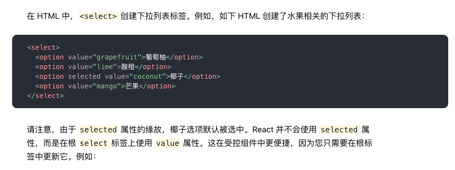
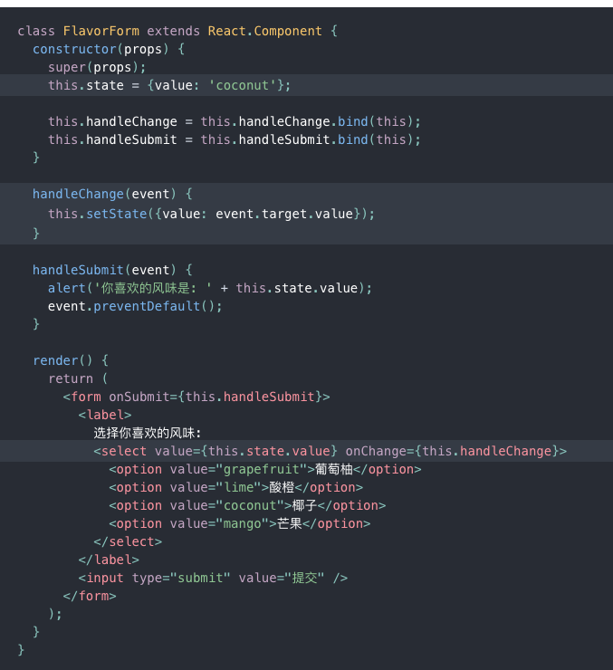

# 一、Create React App
1. 安装：npm install -g create-react-app
2. 创建工程：create-react-app react-demo
# 二、React核心语法
1. JSX
    - JSX具有JavaScript的全部功能
    - JSX将变量包裹在大括号中，在大括号内放置任何有效的JavaScript表达[JSX也是表达式]
    - JSX将字符串字面量包裹在引号中
    - 仅使用引号（对于字符串值）或大括号（对于表达式）中的一个，对于同一属性不能同时使用这两种符号
    - 使用 camelCase（小驼峰命名）来定义属性的名称
    - React DOM 在渲染所有输入内容之前，默认会进行转义，可以防止XSS攻击
2. 元素渲染
    - 
    ```javascript
    setInterval(() => {
        ReactDOM.render(<h1>{new Date().toLocaleTimeString()}</h1>, $root)
    }, 1000)
    ```
    在setInterval函数中，尽管每秒都在调用render函数，但React DOM 会将元素和它的子元素与它们之前的状态进行比较，并只会进行必要的更新来使 DOM 达到预期的状态。
3. 组件 & Props
    - 组件
        - 组件名称必须以大写字母开头
        - 组件形式：class[有状态], function[无状态]
        - 提取组件：将组件拆分为更小的组件
    - Props
        - Props的只读性：组件无论是使用函数声明还是通过 class 声明，都决不能修改自身的 props
    - 组件通讯
        - 父传子[props]
            - 父传递：`<Child data={this.state.cart}/>`
            - 子接收：props.data
        - 子传父
            - 父监听：`<Child addCount={this.addCount}/>  addCount = ()=> {}`
            - 子触发：`onClick={()=>props.addCount(item)}`
        - Context
            - vuejs的privide&inject模式参考了context
            - Context 提供了一个无需为每层组件手动添加 props，就能在组件树间进行数据传递的方法
            - 这种模式下有两个角色，一个是Provider 一个是Consumer ，Provider在外城的组件，内部需要数据的，就用 Consumer来读取
            ```javascript
            const FormContext = React.createContext()
            const FormProvider = FormContext.Provider
            const FormConsumer = FormContext.Consumer
            ```
    - 生命周期
        - constructor -> componentWillMount -> componentDidMount -> componentWillReceiveProps -> shouldComponentUpdate -> componentWillUpdate -> compopnentDidUpdate
4. 状态
    - State 与 props 类似，但是 state 是私有的，并且完全受控于当前组件。
    - 正确使用State
        - 不要直接修改 State
            - // Wrong `this.state.comment = 'Hello';`
            - // Correct  `this.setState({comment: 'Hello'});`
        - State 的更新可能是异步的
        ```javascript
        this.setState((preState, preProps) => ({
            count: preState.count + 1
        }), () => {
            console.log('在setState的回调函数里，正确取到了值', this.state.count)
        })
        console.log('因为setState()是异步的,所以我这里取到的值是错误的', this.state.count)
        ```
        - State 的更新会被合并
        ```javascript
        this.state = {
            A: 1,
            B: 2,
        }
        this.setState({A: 3})
        this.setState({B: 4})
        //以上两个操作最终会合并，使得A=3,B=4
        ```
5. 事件处理
    - 事件名采用驼峰写法，如`onClick={handler}`
    - 不能通过返回 false 的方式阻止默认行为, 必须显式的使用 preventDefault
    - 确定this的指向
        - 方法1：`this.handleClick = this.handleClick.bind(this);`
        - 方法2：`onClick={(e) => this.handleClick(e)}`
        - 方法3：`handleClick = () => {console.log('this is:', this);}`
        - 方法3问题在于每次渲染 LoggingButton 时都会创建不同的回调函数。在大多数情况下，这没什么问题，但如果该回调函数作为 prop 传入子组件时，这些组件可能会进行额外的重新渲染。我们通常建议在构造器中绑定或使用 class fields 语法来避免这类性能问题。
6. 条件渲染
    - 三元表达式
7. 列表 & Key
    - `const goods = this.state.goods.map(item => <li key={item.id}>{item.text}<button onClick={()=>this.addToCart(item)}>加购</button></li>)`
    - 元素的 key 只有放在就近的数组上下文中才有意义：一个好的经验法则是，在 map() 方法中的元素需要设置 key 属性
8. 表单：受控组件[双向数据绑定]
    - input
    ```javascript
        <input type="text" value={this.state.good} onChange={e=>this.goodChange(e)}/>
        goodChange(e) {
            this.setState({
                good: e.target.value
            })
        }
    ```
    - textarea 
        - `<textarea>`使用 value 属性代替，这样可以使得使用`<textarea>`的表单和使用单行 input 的表单非常类似
    - select  
          
        
    - 总的来说，`<input type="text">`, `<textarea>` 和 `<select>` 之类的标签都非常相似,它们使用value + onChange事件实现受控组件
    - 文件 `<input type="file"/>` 标签
        - 因为它的 value 只读，所以它是 React 中的一个非受控组件
# 三、组件化
1. 容器组件 VS 展示组件
    - 容器组件负责数据获取，展示组件负责根据props显示信息
2. 纯组件
    - Component不会比较当前和下个状态的props和state。因此，每当shouldComponentUpdate被调用时，组件默认的会重新渲染。优化 ——
    - Component + shouldComponentUpdate判断是否更新：`shouldComponentUpdate(nextProps, nextState) { return !(nextProps === this.props && nextState === this.state)}`
        - 缺点：麻烦
    - PureComponent
        - 当props或者state改变时，PureComponent将对props和state进行浅比较，如果一样，则shouldComponentUpdate返回false
        - 缺点：有使用限制
            - 确保数据类型是值类型
            - 如果是引用类型，确保地址不变，同时不应当有深层次的数据变化
            - 必须是class组件。优化 ——>
    - React.meno()
        - React.memo()是一个高阶函数，它与 React.PureComponent类似，但是一个函数组件而非一个类
    - vue框架内部已经对此做了优化, 开发者不需要考虑该类问题, 只需要关注自己的应用本身就可以了
3. 复合组件
    - 比如：小组件负责渲染数据，中组件负责处理逻辑，大组件负责展示视图
4. 高阶组件（HOC）
    - 高阶组件是一个函数
    - 可以重写组件生命周期
    - 装饰器 + 高阶组件写法
        - 装饰器使用前提
            - 安装babel插件：`npm install --save-dev babel-plugin-transform-decorators-legacy`
            - 加一点配置[config-overrides.js]：`["@babel/plugin-proposal-decorators", { legacy: true }]`
5. Hook: 在不编写 class 的情况下使用 state 以及其他的 React 特性
    - 状态钩子：State Hook
        - useState
    - 副作用钩子：Effect Hook
        - 它跟class组件中的componentDidMount,componentDidUpdate,componentWillUnmount具有相同的功能，只不过被合并成了一个API
        - useEffect
# 四、React全家桶
# 五、其它
1. 命令行
    - 删除一个文件夹下面所有的文件
        - MAC: rm -f *
        - WIN: del *
2. ES6
    - Module
3. ES7
    - Decorator 装饰器
4. React相关库
    - UI库：antd
    